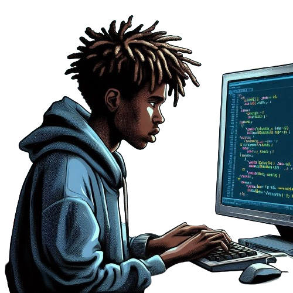

# Olá, eu sou o Rodrigo

```kotlin
if (contratado == True)
{
    println ("Feliz da vida!!!")
}
else
{
    println("Continuarei tentando!")
}
```
<br>

<div align="center">  
<a href="https://www.instagram.com/digonomundo" target="_blank"></a>
<a href="https://www.linkedin.com/in/digonomundo" target="_blank"></a>
</div>
